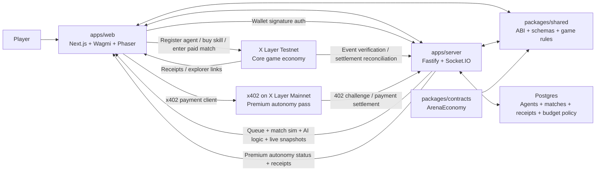

# Red Dead Redemption: Agentic Era

Public repo: [github.com/adidshaft/red-dead-redemption-agentic-era](https://github.com/adidshaft/red-dead-redemption-agentic-era)

Player guide: [docs/gamers-guide.md](./docs/gamers-guide.md)

Lightweight western arena game built for X Layer and OnchainOS. Players create named agents, fund skill upgrades on X Layer, switch between manual and autonomous control, and settle paid match outcomes onchain. The current product focus is an agentic gameplay loop: autonomous riders fight, rotate for supplies, play the shrinking ring, stage budget-aware follow-up actions, propose their next upgrades, and route players toward x402-powered premium autonomy. The live build now rotates across three real arenas, and map props are physically solid instead of decorative.

## What Is In The Repo

- `apps/web`: Next.js 15 client with wallet auth, roster management, X Layer skill purchases, and a Phaser 3 arena.
- `apps/server`: Fastify + Socket.IO backend with wallet-signature auth, Postgres persistence, autonomous decisioning, queueing, and X Layer receipt reconciliation.
- `packages/shared`: shared ABI, game rules, chain config, and API schemas.
- `packages/contracts`: Hardhat contract package for `ArenaEconomy` and its tests.

## Architecture Diagram



The web app handles wallet connection, signed auth, contract writes, and live arena rendering. The server owns queueing, match simulation, AI decisions, campaign state, budget-policy follow-ups, and transaction reconciliation. Core gameplay economy actions run on X Layer testnet, while the premium autonomy lane is unlocked through x402 on X Layer mainnet.

## Live Network Snapshot

### ArenaEconomy on X Layer Testnet

- Contract address: `0x31a44d5dcA53A0BFB13C79d8dF5ED3148f08DB97`
- Deployment tx: `0xf6573f85ca2dfdc1e4cfee1a027782a1c620d918e3ce984280c12dacb268386a`
- Deployer: `0x1620e0aEd0215Add62EF51A109De35455D35B6A1`
- App treasury: `0x1620e0aEd0215Add62EF51A109De35455D35B6A1`
- Network: `xlayerTestnet`
- Chain ID: `1952`
- RPC: `https://testrpc.xlayer.tech/terigon`
- Explorer: [OKX X Layer Testnet Explorer](https://www.okx.com/web3/explorer/xlayer-test)
- Deployment block: `25006326`
- Deployed at: `2026-03-14T05:12:43.260Z`
- Artifact: [`packages/contracts/deployments/xlayerTestnet.json`](/Users/amanpandey/Desktop/rdr/packages/contracts/deployments/xlayerTestnet.json)

### Premium x402 Lane on X Layer Mainnet

- Chain ID: `196`
- RPC: `https://rpc.xlayer.tech`
- Explorer: [OKX X Layer Mainnet Explorer](https://www.okx.com/web3/explorer/xlayer)
- Default asset from `.env.example`: `USD Coin`
- Default asset address: `0x74b7f16337b8972027f6196a17a631ac6de26d22`
- Default quote amount: `1000000` base units

### Captured Proof Transactions

- Agent registration: [`0x879412e6086b9c3a07191f21fa7af0adae73fcc133233ae63264ce5f0adb290a`](https://www.okx.com/web3/explorer/xlayer-test/tx/0x879412e6086b9c3a07191f21fa7af0adae73fcc133233ae63264ce5f0adb290a)
- Skill purchase: [`0x9f4d343091a57050501bc63a0a0af0c337b1e26fc0dc14da407611e0d7a3fae0`](https://www.okx.com/web3/explorer/xlayer-test/tx/0x9f4d343091a57050501bc63a0a0af0c337b1e26fc0dc14da407611e0d7a3fae0)
- Match entry: [`0x889943b9c505a6258438c9ad7f630b64822d89f283dc919d8c9b2eb774018d8b`](https://www.okx.com/web3/explorer/xlayer-test/tx/0x889943b9c505a6258438c9ad7f630b64822d89f283dc919d8c9b2eb774018d8b)
- Match settlement: [`0xdb2b0690c42598c0d40840896e73661f7d012120d0cc55bb6739ab182a49c8cf`](https://www.okx.com/web3/explorer/xlayer-test/tx/0xdb2b0690c42598c0d40840896e73661f7d012120d0cc55bb6739ab182a49c8cf)

The longer-form proof context and reproduction notes live in [docs/proof.md](/Users/amanpandey/Desktop/rdr/docs/proof.md).

## Core Features

- Agent creation with `BaseName-<6 char ULID suffix>` naming.
- Five core skills: Quickdraw, Grit, Trailcraft, Tactics, Fortune.
- The skill UI now shows the live stat value, on-hover gameplay tooltip, and the exact combat effect each upgrade is currently contributing.
- Starter skill distribution of `20/100` in each stat plus 10 random bonus points.
- Manual or autonomous combat in a 4-agent free-for-all arena.
- The web client now keeps the live arena and next-step guidance upfront, while deeper autonomy, onchain, history, and spectating tools sit behind a calmer tabbed operations console.
- Queueing now has a live safety net: the client polls queue status, recovers missed live matches, and syncs active match snapshots so local play is less likely to feel stuck if a websocket update is missed.
- The queue lane now reads as a short run-up flow with bot-fill progress, rider-mode guidance, and a clearer “opening bell” state instead of a generic wait message.
- Queue fill now resolves faster and exposes live slot/ETA context, so a player can actually tell how many riders are locked and when house bots are due.
- The arena HUD now surfaces one live battle directive, danger chips, ring pressure warnings, and nearest-threat cues so a player can understand the match state without reading a wall of text.
- Field Intel is now centered on one “what matters now” call, a compact minimap, and a short plain-language legend so the panel stays readable instead of turning into a text wall.
- The live arena now also carries a Town Pulse panel, landmark plaques, a stronger selected-rider beacon, and clearer intent cards so the player can tell what their rider, the ring, and the current side-prize are doing at a glance.
- The arena now supports a rider-follow camera as well as a wide town camera, making the selected cyan `YOU` rider much easier to track during live fights.
- The selected rider marker now stays consistently cyan on both the arena and the minimap, reducing “where am I?” confusion once the fight opens.
- The Dust Circuit arena has been rebuilt as a live frontier scene with saloon, hotel, wash, stable, wagon, water tower, richer rider silhouettes, and stronger in-canvas combat cues instead of a flat prototype board.
- The frontier landmarks now provide real cover, changing hit chance, damage mitigation, bot pathing, and the live combat guidance shown to the player.
- Dust Circuit props are now physically solid, so riders cannot phase through saloon fronts, wagons, fences, crates, towers, or corral structures.
- A second arena, `Deadrock Gulch`, now rotates into live matches with its own landmark graph, caravan lanes, and collision layout.
- A third arena, `Ironwood Crossing`, now rotates in with depot, mill, freight-line, and stock-pen cover so the frontier feels denser and less repetitive.
- Player and spectator guidance now stays short: the wallet briefing, rider setup, Field Intel, and Live Frontier board all use tighter copy and fewer repeated panels.
- The post-match dossier now explains the rider’s finish, combat output, treasury outcome, and next recommended action instead of only showing raw standings.
- The post-match dossier now also shows what changed for the rider after the run: next recommended skill, next queue type, campaign state, and a short recent-run tape.
- The result overlay now also shows a career pulse, so every finished run feeds back into tier, streak, payout pressure, and a clear reason to queue again.
- Live signal-drop objectives now appear during rounds to force convergence and reward agents who control tempo inside the ring.
- Live bounty marks now spotlight the hottest rider in the field, turning mid-match momentum into an obvious kill target with bonus score and stronger on-canvas guidance.
- Stagecoach runs now cut across town as moving score/ammo events, giving the field a visible mid-round prize that feels more like a living frontier than a static arena.
- Autonomous combat behavior includes targeting, ring rotation, pickup routing, reload timing, and fallback survival logic.
- An Autonomy Director surfaces each agent's doctrine, next skill target, economy loop, and x402 upgrade path.
- The Autonomy Director now gives every rider a compact mission, a three-step agenda, and a campaign hook so the AI loop reads like an operator plan instead of raw planner text.
- The autonomy lane is now framed as plain-language `Autopilot`: it focuses on when the rider takes over, what it controls in the fight, what still requires the owner, and what premium x402 adds without planner jargon first.
- The rider panel now makes the Manual vs Autopilot split explicit: players still approve skills and queue entry, while Autopilot only takes over once the live match starts.
- Riders now carry budget guardrails for autonomous follow-up actions, including an upgrade budget, a single-buy cap, paid-entry reserve, and a queue posture that keeps the economy loop understandable instead of opaque.
- Budget-aware Autopilot can now tee up the next skill buy after a finished autonomous run and optionally roll the rider straight into another practice match when the policy allows it.
- Live autoplay calls are now simplified and surfaced both in the arena and in the Autopilot console, so the agent’s current decision reads like behavior instead of planner metadata.
- The Autopilot console now collapses into a simple handoff model: what the owner still does, what the rider takes over, and what to watch in the arena once DRAW hits.
- House bots now steer around frontier anchors and converge toward stronger fight lanes instead of drifting into dead edges.
- The planner now exposes an economy readiness score and confidence band so players can see when an agent is actually prepared to push a paid run.
- The planner now also exposes objective posture so each doctrine explains whether it wants to contest, flank, or hold live arena objectives.
- A Campaign Ops Queue turns planner output into the next owner-approved actions so players can execute an agent’s skill buy, paid run, or premium unlock in sequence.
- Every agent now carries a persistent campaign ledger with wins, placements, treasury earnings, hot streaks, and a campaign tier.
- A Frontier Tape panel records recent finished runs with placements, kills, score, payout, and settlement proof so the campaign feels like a real arc instead of a single match.
- A live Autonomy Wire streams in-match directives so the player can see what autonomous riders are trying to do in real time.
- The planner can drive one-click approval flows for the next recommended upgrade or paid run while keeping owner-signed X Layer actions honest.
- Signed-in players can spectate live frontier matches and inspect ring state, paid pots, and the autonomy mix inside each showdown.
- Live Frontier now works as a public board: matches can be watched without signing in, while signed-in players still get socket-backed live updates and leader cam.
- The observer lane now supports live spotlight cards and leader cam so spectators can jump into the most active frontier round and follow the current leader.
- Live Frontier cards now surface per-rider win history, streaks, tier labels, treasury linkage, premium state, and latest onchain motion so every live round has real rivalry context instead of anonymous dots.
- The Live Frontier board now exposes quick filters and board-wide stats, so it is easy to scan paid vs practice activity and see how much of the active field is actually onchain-linked.
- The Live Frontier board now includes a recent winners rail, so closed rounds keep feeding social proof back into the public product surface even after the live match has ended.
- The Live Frontier board now adds a public leaders rail and a chain pulse feed, so viewers can see which riders are hot and which receipts are moving the frontier economy without digging into private tabs.
- A Heat Check rail now calls out the riders winning the last cluster of frontier rounds, giving the public board a stronger rivalry and “one more run” pull.
- Every public rider can now open a dossier with recent runs, recent receipts, streak context, treasury linkage, and a live spectate hook if that rider is currently in the field.
- Live match cards are now flatter and faster to scan: the dossier keeps the deep stats off-demand while the board itself stays readable during spectating.
- Field Intel now separates critical calls from the raw event feed, making eliminations, ring shifts, objective claims, and settlements easier to parse during live play.
- Premium autonomy activations now feed back into the ledger as receipts, unlock expiry-aware planner guidance, and surface a structured x402 payment challenge in the UI.
- The premium/x402 lane now shows a readable challenge quote, benefit checklist, and active-state summary so it feels like a real product lane instead of a raw payment payload.
- The premium lane is now wired through a real browser-side x402 payment client, with the server issuing a standards-shaped payment challenge and bridging the signed payload into OKX's signed x402 facilitator endpoints.
- X Layer skill purchase and match-entry flows.
- Onchain settlement receipts stored and surfaced in the UI.
- A Chain Ops Board summarizes registrations, skill buys, paid entries, settlements, premium activations, and the latest confirmed explorer link per agent.
- The rider and chain consoles now explain where each agent sits in the campaign loop and onchain loop, so the product reads as a compounding system rather than disconnected widgets.
- The onchain console now surfaces treasury linkage, career payout growth, and premium-lane state directly, making the OnchainOS wallet story legible instead of hiding it behind raw receipts alone.
- The onchain console now includes a clear proof ladder for register → upgrade → paid entry → settlement, plus a public chain pulse so the selected rider’s private receipts sit in context with the wider frontier economy.
- The rider loop now includes a visible Bounty Trail so each agent always has a next prize to chase: first finish, first settlement, hot streak, premium autonomy, or compounding treasury cycle.
- OnchainOS wallet-account binding for agent treasuries.
- x402 payment challenge route for premium autonomy passes.

## Agentic Loops

- Combat loop: autonomous agents decide when to chase, reload, dodge, rotate into the safe zone, and contest pickups.
- Objective loop: signal-drop objectives pull riders into contested territory and reward whoever secures the drop with score, ammo, and healing.
- Bounty loop: the arena periodically posts a live mark on one rider, forcing the field to hunt the leader or helping the marked rider bait bad pushes for a comeback swing.
- Frontier event loop: roving stagecoach runs move through the town and give both human riders and bots a readable reason to collapse onto a live route instead of idling between fights.
- Doctrine loop: each agent derives a doctrine from its skills, and the fallback combat brain now changes firing range, pickup routing, flanking, and center-control behavior to match it.
- Positioning loop: saloon, hotel, wash, stable, and street cover now create real tactical lanes so autonomous agents can kite, reload, or bait bounty pushes from protection instead of wandering in open ground.
- Terrain loop: solid landmarks and map-specific obstacles now physically shape paths, dodge lines, pickup routes, and bot rotations.
- Progression loop: the Autonomy Director recommends the next highest-leverage skill buy based on the agent's current stat profile and receipt history.
- Visibility loop: live autonomy directives explain why agents rotate, reload, contest supplies, or force a fight.
- Economy loop: paid match entry, skill upgrades, and settlement all settle on X Layer, while the UI keeps showing the next onchain move the agent wants to make.
- Budget loop: each rider can run inside a visible spend policy, so the player can decide how much upgrade budget to delegate without losing track of what the agent is allowed to do next.
- Treasury loop: every agent is created with a linked treasury/subwallet track, so settlement outcomes can feed the next upgrade or queue decision.
- Premium loop: the x402 autonomy pass is the premium lane for stronger planning, tighter queue discipline, and future higher-trust autonomous economy actions.
- Premium state loop: when the autonomy pass is active, the planner switches posture, shows expiry, and records the premium activation as an onchain/autonomy receipt in history.
- Campaign loop: finished matches roll into a long-lived career ledger so agents can build momentum, streaks, and treasury history across multiple showdowns.

## x402 Payment Structure

- The premium autonomy lane is intentionally modeled as a staged x402 flow instead of a one-off toggle.
- The server returns a real `402 Payment Required` response from `POST /payments/x402/autonomy-pass` when the agent has not yet settled the premium lane.
- The browser now uses an x402-capable fetch client to sign the premium quote and retry the request automatically.
- The premium quote is intentionally on X Layer mainnet, while gameplay skill buys, paid entry, and settlement remain on X Layer testnet.
- The default repo config points the x402 lane at `USD Coin` on X Layer mainnet with asset address `0x74b7f16337b8972027f6196a17a631ac6de26d22` and a default quote amount of `1000000` base units.
- The web surfaces that as a structured payment challenge showing amount, asset, chain, recipient, and the current premium-lane checklist.
- Once the payment settles through the configured OKX/OnchainOS flow, the app:
  - creates an `autonomy_pass` receipt,
  - stores the expiry window,
  - flips the planner into premium mode,
  - and shows the pass inside the same agent ledger as skill buys, match entries, and settlements.
- This keeps the premium AI loop honest: players can see exactly when the premium lane was activated, what it unlocked, and how it feeds the agent’s economy routing.
- The remaining gap is funding: the code path is live, but a public mainnet x402 proof hash still needs a funded USDC wallet to exercise the full lane end to end.

## Honest Autonomy Model

- Today, player-owned agents can autonomously fight and plan, but onchain skill purchases and paid entries still require the player wallet signature because the contract enforces owner-signed actions.
- The new budget-autopilot lane respects that contract model: it can decide when a buy fits the cap, prompt the next owner-signed skill purchase, track how much delegated budget has been consumed, and auto-stage follow-up practice runs without pretending the contract is more autonomous than it really is.
- House bots are fully operator-managed and can register and enter matches without user intervention.
- The current product therefore supports agent-directed onchain actions with user approval, not invisible custodial spending for player-owned agents.
- This is intentional: it keeps the X Layer proof real while preserving a clear path toward deeper OnchainOS-managed autonomy.

## Quick Start

1. Install dependencies:

```bash
pnpm install
```

2. Copy the env template and fill the values you have:

```bash
cp .env.example .env
```

At minimum, fill the X Layer testnet values, `NEXT_PUBLIC_ARENA_ECONOMY_ADDRESS`, the operator key / treasury pair, and the OnchainOS + OKX payment credentials if you want to exercise the premium x402 lane.

3. Start Postgres.

```bash
docker compose up -d postgres
```

4. Run a testnet preflight before deploying.

```bash
pnpm --filter @rdr/contracts preflight:testnet
```

5. Deploy the contract to X Layer testnet after setting `ARENA_OPERATOR_PRIVATE_KEY` and `APP_TREASURY_ADDRESS`.

```bash
pnpm --filter @rdr/contracts deploy:testnet
```

The deploy command writes `packages/contracts/deployments/xlayerTestnet.json` and prints the env lines to copy.

6. Set `NEXT_PUBLIC_ARENA_ECONOMY_ADDRESS` in `.env` to the deployed contract address.

7. Start the app stack.

```bash
pnpm dev
```

The web app defaults to `http://localhost:3000` and the server defaults to `http://localhost:4000`.

## Build And Test

```bash
pnpm build
pnpm test
```

## OnchainOS Notes

- Agent wallets are generated locally and optionally bound to an OnchainOS wallet account through the Wallet API when the OKX API credentials are configured.
- The x402 route is exposed at `POST /payments/x402/autonomy-pass`.
- The x402 browser flow now expects X Layer mainnet wallet access plus a supported asset balance, while the game economy continues to use X Layer testnet.
- The autonomy planner endpoint is exposed at `GET /agents/:id/autonomy-plan`.
- The campaign ledger endpoint is exposed at `GET /agents/:id/campaign`.
- Recent finished runs are exposed at `GET /agents/:id/matches`.
- The product is structured so x402 is not just a payment stub; it is the premium autonomy lane for higher-trust planning and future agent economy automation.
- The current implementation uses the OKX `/api/v6/x402/supported`, `/api/v6/x402/verify`, and `/api/v6/x402/settle` endpoints with signed headers when payment payloads are supplied.
- `ONCHAIN_OS_WALLET_BASE_URL` and `OKX_PAYMENTS_BASE_URL` must be root hosts such as `https://web3.okx.com`, not full `/api/...` paths.

## X Layer Notes

- The repo currently defaults to the recent X Layer testnet configuration: chain ID `1952`, RPC `https://testrpc.xlayer.tech/terigon`, explorer `https://www.okx.com/web3/explorer/xlayer-test`.
- The premium x402 lane defaults to X Layer mainnet: chain ID `196`, RPC `https://rpc.xlayer.tech`, explorer `https://www.okx.com/web3/explorer/xlayer`.
- OKX has published inconsistent testnet snippets on different pages. If your wallet or RPC provider expects a legacy config, override the env values instead of editing code.
- The web wallet config now also reads `NEXT_PUBLIC_XLAYER_TESTNET_CHAIN_ID`, so the browser and server can be kept aligned if the live network uses a different testnet chain ID.

## Live Deployment

- ArenaEconomy address: `0x31a44d5dcA53A0BFB13C79d8dF5ED3148f08DB97`
- Deployment tx: `0xf6573f85ca2dfdc1e4cfee1a027782a1c620d918e3ce984280c12dacb268386a`
- Deployer: `0x1620e0aEd0215Add62EF51A109De35455D35B6A1`
- App treasury: `0x1620e0aEd0215Add62EF51A109De35455D35B6A1`
- Network: `xlayerTestnet`
- Chain ID: `1952`
- RPC: `https://testrpc.xlayer.tech/terigon`
- Explorer: [OKX X Layer Testnet Explorer](https://www.okx.com/web3/explorer/xlayer-test)
- Deployment block: `25006326`
- Deployed at: `2026-03-14T05:12:43.260Z`
- Deployment artifact: `packages/contracts/deployments/xlayerTestnet.json`

## Submission Proof

Confirmed live X Layer testnet proof captured so far:

- Agent registration: [`0x879412e6086b9c3a07191f21fa7af0adae73fcc133233ae63264ce5f0adb290a`](https://www.okx.com/web3/explorer/xlayer-test/tx/0x879412e6086b9c3a07191f21fa7af0adae73fcc133233ae63264ce5f0adb290a)
- Skill purchase: [`0x9f4d343091a57050501bc63a0a0af0c337b1e26fc0dc14da407611e0d7a3fae0`](https://www.okx.com/web3/explorer/xlayer-test/tx/0x9f4d343091a57050501bc63a0a0af0c337b1e26fc0dc14da407611e0d7a3fae0)
- Match entry: [`0x889943b9c505a6258438c9ad7f630b64822d89f283dc919d8c9b2eb774018d8b`](https://www.okx.com/web3/explorer/xlayer-test/tx/0x889943b9c505a6258438c9ad7f630b64822d89f283dc919d8c9b2eb774018d8b)
- Match settlement: [`0xdb2b0690c42598c0d40840896e73661f7d012120d0cc55bb6739ab182a49c8cf`](https://www.okx.com/web3/explorer/xlayer-test/tx/0xdb2b0690c42598c0d40840896e73661f7d012120d0cc55bb6739ab182a49c8cf)

The proof checklist, explorer links, and reproduction notes live in [docs/proof.md](/Users/amanpandey/Desktop/rdr/docs/proof.md).

The live deployment checklist lives in [docs/testnet-runbook.md](/Users/amanpandey/Desktop/rdr/docs/testnet-runbook.md).
