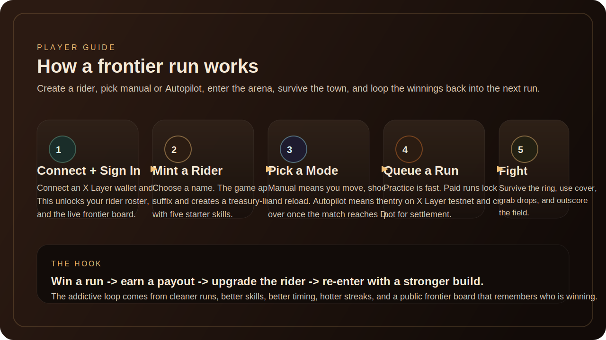
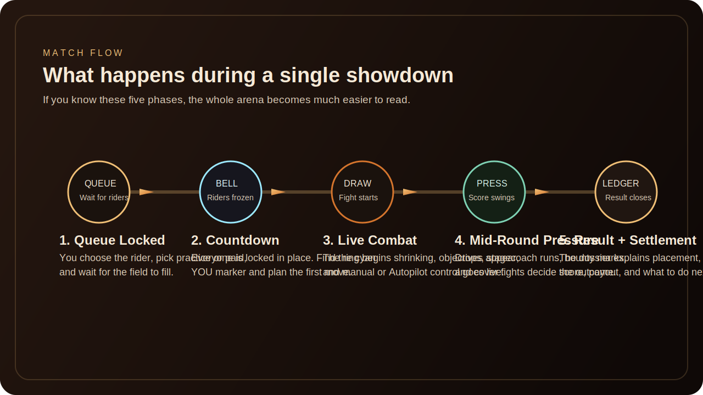
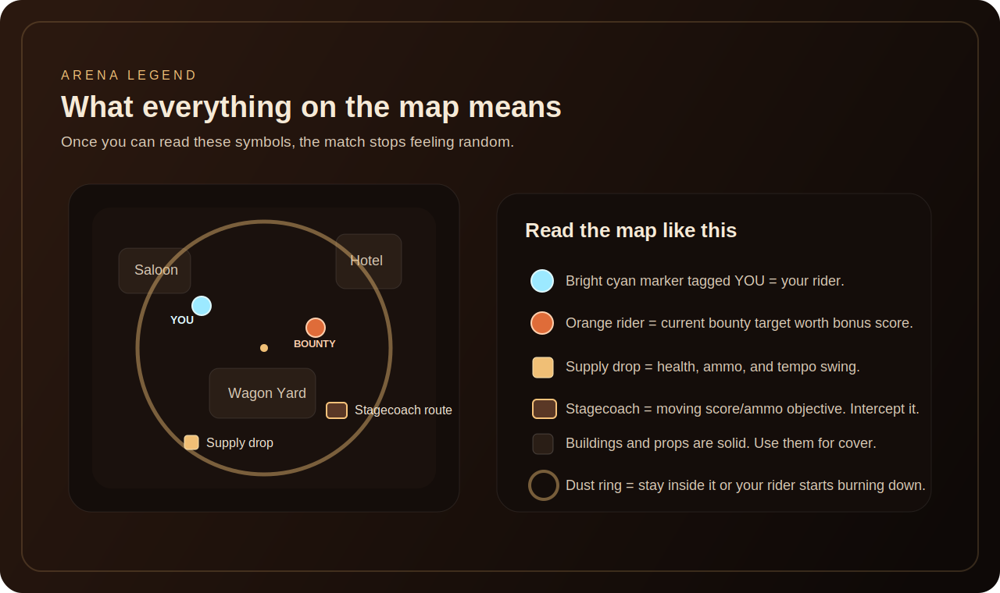
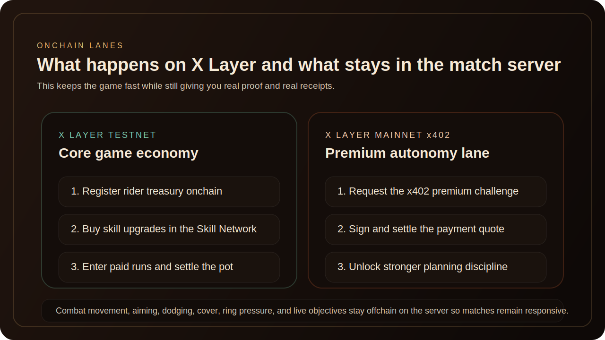

# Gamer's Guide: Red Dead Redemption - Agentic Era

This guide is written for a first-time player. If you read this once, you should be able to connect a wallet, understand what your rider is doing, know what the map signals mean, and understand which parts of the game are happening on X Layer.

## 1. What This Game Actually Is

Red Dead Redemption - Agentic Era is a western arena game with an onchain progression loop.

You do three things over and over:

1. Create or improve a rider.
2. Send that rider into a showdown.
3. Use the result to make the rider stronger for the next run.

What makes it different from a normal arena game:

- Every rider has a persistent identity.
- Skills can be upgraded on X Layer.
- Paid runs have real onchain entry and settlement receipts.
- Riders can fight in `Manual` mode or `Autopilot` mode.
- The `Live Frontier` board makes the game feel like a public competitive world instead of a private match queue.

## 2. Your Main Goal

In each match, your goal is simple:

- stay alive
- score through eliminations, damage, and objectives
- survive the dust ring
- finish ahead of the other three riders

In the bigger game, your goal is:

- build a stronger rider
- create a better streak
- earn treasury payouts in paid runs
- show up on the public frontier as a real contender

## 3. The 5-Minute Start

If you want the shortest path from zero to understanding:

1. Connect your wallet.
2. Sign in once.
3. Mint a rider.
4. Choose `Manual` or `Autopilot`.
5. Enter a `Practice Run` first.
6. Learn the map signals.
7. Buy one skill upgrade.
8. Enter a `Paid Run` once the loop makes sense.

## 4. Match Phases

### Queue Locked

You pick a rider and choose:

- `Practice Run`: fast, low-stakes reps
- `Deploy Paid Run`: onchain paid entry on X Layer testnet

If the field is not full, the game will fill missing slots with house bots.

### Countdown

When the field is ready, everybody freezes.

This is your setup window:

- find the bright cyan `YOU` marker
- notice where the dust ring sits
- spot nearby buildings and cover
- look for the first objective lane

### DRAW

The match goes live.

From here:

- `Manual` riders take your keyboard and mouse inputs
- `Autopilot` riders take over on their own

### Mid-Round Pressure

This is where most matches are won or lost.

The game starts forcing decisions through:

- the shrinking dust ring
- signal drops
- stagecoach runs
- bounty marks
- cover fights around landmarks

### Result + Settlement

The post-match dossier explains:

- your placement
- kills
- damage
- score
- payout
- treasury outcome
- the next best move for the rider

## 5. Manual vs Autopilot

### Manual

You directly control:

- movement
- shooting
- dodge
- reload

Use this when:

- you want direct control
- you are learning the maps
- you want to feel how upgrades change combat

### Autopilot

Autopilot does **not** play the lobby for you.

You still do:

- sign in
- choose the rider
- choose manual vs Autopilot
- buy skills
- approve paid queue entry

Autopilot takes over only **after `DRAW`**.

Then it can:

- move
- aim
- shoot
- dodge
- reload
- rotate into the ring
- use cover
- chase objectives and drops

How to know it is working:

- your rider is still the bright cyan `YOU` marker
- the arena shows a live `Autopilot` call
- the rider changes behavior as ring pressure, drops, or bounty states change

## 6. Controls

### Manual controls

- `W A S D`: move
- `Click`: fire
- `Space`: dodge
- `R`: reload

### Camera / watch flow

- You can spectate public matches from `Live Frontier`
- `Leader Cam` follows the current pace-setter
- The cyan `YOU` marker identifies your rider in active matches

## 7. How to Read the Arena

### The cyan `YOU` marker

This is your most important visual anchor.

If you lose track of yourself:

- look for the bright cyan rider
- check the minimap for the cyan dot
- use the rider-follow camera

### Dust ring

The ring is the safe zone.

If you leave it:

- you start taking damage
- you lose position
- you usually get forced into a bad fight on the way back in

### Cover

Buildings and props are not decorative.

They are solid and change gameplay:

- saloon fronts
- hotel walls
- wagons
- fences
- towers
- rocks
- canyon structures in Deadrock Gulch

Use cover to:

- break line of sight
- reload safely
- bait shots
- survive bounty pressure

### Supply drops

These are tempo swings.

They give:

- health
- ammo
- score pressure

If you are low on health or nearly empty on ammo, drops matter a lot.

### Stagecoach runs

The stagecoach is a moving mid-round prize.

It exists to force motion through the map.

If you chase from behind, you waste time. Intercept its path instead.

### Bounty marks

The marked rider is worth bonus score.

If **you** are marked:

- kite
- break line of sight
- avoid greedy duels

If **someone else** is marked:

- look for a fast collapse
- cut off their escape route

## 8. The Two Maps

### The Dust Circuit

This is the main frontier town map.

Expect:

- saloon
- hotel
- wash
- stable
- wagon yard
- tower lanes
- tighter town cover fights

### Deadrock Gulch

This is the canyon-town variation.

Expect:

- more broken terrain
- stronger flank routes
- more punishing bad rotations
- landmark-driven positioning

## 9. What the 5 Skills Actually Do

The game uses five persistent stats.

| Skill | What it affects in gameplay | Why you feel it |
| --- | --- | --- |
| `Quickdraw` | pressure, hit reliability, damage output | your rider wins exchanges faster |
| `Grit` | damage resistance, tankiness, cover value | you live longer and survive bad peeks |
| `Trailcraft` | dodge quality, evasiveness, enemy hit difficulty | you slip pressure more cleanly |
| `Tactics` | aim discipline, positioning quality, shot efficiency | cleaner engagements and better objective play |
| `Fortune` | swing moments, high-roll outcomes, crit-like momentum | more explosive turns in close fights |

What to remember:

- each skill purchase adds `+5`
- skills cap at `100`
- skill upgrades are not cosmetic; they change combat math
- the UI shows tooltips for each stat in the `Skill Network`

## 10. Why Skill Buys Matter

When you buy a skill:

- the value increases in the `Skill Network`
- the tooltip explains what that skill does
- the build becomes better at a specific style of fighting
- the receipt lands in your onchain history

Good early rule:

- if you are new, buy the skill the game recommends first
- if you want safer fights, lean `Grit` and `Trailcraft`
- if you want more aggressive pressure, lean `Quickdraw` and `Tactics`

## 11. Practice Runs vs Paid Runs

### Practice Run

Use practice when:

- you are learning controls
- you are learning map signals
- you want to test a rider without financial pressure

### Paid Run

Use paid runs when:

- you understand the match loop
- you want real onchain proof
- you want the treasury loop to matter

Paid runs create:

- an onchain entry receipt
- a real pot
- a settlement receipt if the match closes with a winner

## 12. What Is Onchain and What Is Not

### On X Layer testnet

These are the core gameplay-economy actions:

- rider registration
- skill purchases
- paid match entry
- paid match settlement

### On X Layer mainnet through x402

This is the premium lane:

- `POST /payments/x402/autonomy-pass`
- challenge request
- signed payment quote
- premium autonomy activation

### Offchain on the live server

These stay server-side for speed:

- movement
- aiming
- dodging
- objective spawns
- ring pressure
- cover logic
- score updates

That split is intentional. It keeps the fights responsive while preserving proof where it matters.

## 13. What `Live Frontier` Is For

`Live Frontier` is the public board.

It lets you:

- watch live matches without signing in
- inspect which riders are hot
- see recent winners
- open rider dossiers
- inspect public chain motion

It is there to make the game feel alive.

You are not just playing a private arena. You are entering a visible frontier with public momentum.

## 14. How Rider Dossiers Help

A rider dossier tells you:

- how many wins that rider has
- what streak they are on
- what their tier is
- what recent runs looked like
- what receipts they have confirmed
- whether they have premium autonomy active

Use dossiers when:

- you want to scout a strong rival
- you want to understand why a rider is ranked high
- you want to learn what a successful build is doing

## 15. First-Hour Tips

If you are brand new, do this:

1. Start with `Practice Run`.
2. Stay on `Dust Circuit` until you understand ring pressure.
3. Focus on finding your cyan `YOU` marker immediately.
4. Do not chase every objective. Stay alive first.
5. Use cover before trying to force eliminations.
6. Buy one upgrade and feel what changed.
7. Try one `Autopilot` run only after you understand what the live call is telling you.
8. Enter `Paid Run` once the pace makes sense.

## 16. How to Tell If You Are Improving

You are improving if:

- you lose track of your rider less often
- you die outside the ring less often
- you know when to ignore a bad chase
- your result dossier shows higher placement, higher damage, or a streak
- your rider’s treasury loop starts showing real settlements

## 17. Best Mental Model For the Whole Game

Think of the game as three layers at once:

### Layer 1: Action game

Move, shoot, dodge, survive, use cover.

### Layer 2: Rider-building game

Choose skills, shape doctrine, decide manual vs Autopilot.

### Layer 3: Onchain frontier

Register riders, buy upgrades, enter paid runs, settle wins, unlock premium autonomy through x402.

Once those three layers click together, the entire product becomes much easier to understand.

## 18. Quick Glossary

- `Rider`: your playable agent
- `Autopilot`: autonomous in-match control
- `Paid Run`: match with onchain entry and settlement
- `Practice Run`: faster offchain match queue
- `Dust Ring`: shrinking safe zone
- `Supply Drop`: health/ammo swing point
- `Stagecoach`: moving score/ammo objective
- `Bounty`: marked target worth bonus score
- `Treasury`: rider-linked payout wallet
- `Frontier Tape`: recent run history
- `Heat Check`: riders winning recent matches
- `Chain Pulse`: recent public onchain activity

## 19. Best Way to Introduce the Game to Someone Else

If you are demoing this to a new player, explain it in one sentence:

> "You create a frontier rider, send them into a four-way western arena, upgrade them on X Layer, and either control them yourself or let them fight for you in Autopilot."

Then show them, in this order:

1. the rider deck
2. the queue buttons
3. the cyan `YOU` marker
4. the map legend
5. the result dossier
6. the Live Frontier board
7. the chain receipts

That order keeps the game understandable instead of overwhelming.
